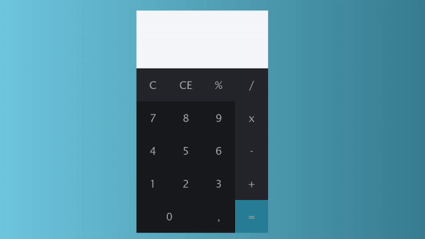
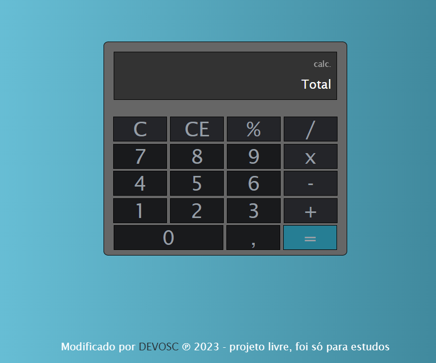

# Javascript-CALC
Basic calculator developed with JS/HTML/CSS.

<!--  -->

Demo available [here](https://andresantos.pt/calc).

feel free to contribute! :)

### Acima é a fonte do projeto;

## Abaixo é o meu final, modificado.

# Imagens 📸

- Peguei para ver e percebi que não estava acabado, fui fazendo e gostei rsrsr

- Fui fazendo ate achar que ja estava melhorado, sei que vai ter outra pessoa que poderá pegar o meu e continuar, fiquem a vontade.

### Voce pode testar no link abaixo:

[clique aqui]{https://devosvaldo2020.github.io/javascript-calc-master/}